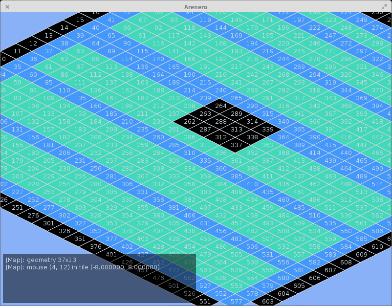

# Arenero

Simple and most probably stupid experiments with 2d
based on [LÖVE](https://love2d.org).

# Status

## Screen

## Tasks

[   5 |   0 ] backlog

27.09.2015 Event based engine core. ([7b167e62](.fl/cards/7b/167e62-d67f-4456-9e60-d27a8477f8c1.md))

27.09.2015 Animation engine. ([83a34c24](.fl/cards/83/a34c24-ecaf-490e-bad9-61a8e4badeee.md))

27.09.2015 Extract core functionality ([af17ea6d](.fl/cards/af/17ea6d-e384-4a27-89cc-75bf772df106.md))

07.10.2015 Map: move the map by offsets not by tiles. ([351e6674](.fl/cards/35/1e6674-738d-4c99-87d8-e3b8c9bad4f8.md))

07.10.2015 Map: unpin map from the most right edge of the screen. ([377cb1c4](.fl/cards/37/7cb1c4-151b-435d-8aba-d1b7cb83b109.md))

[   2 |   3 ] progress

16.09.2015 Add main screen for Arenero. ([4a8b6b86](.fl/cards/4a/8b6b86-5b57-4801-b969-c15f1b7620e4.md))

17.09.2015 Add module for tiled map rendering. ([4c6e8e4d](.fl/cards/4c/6e8e4d-02c5-4459-86c6-16a343a3858e.md))

[   1 |   0 ] done

07.10.2015 Map: draw tile at the very bottom edge. ([2011fa93](.fl/cards/20/11fa93-5f69-4079-a878-f6efb902d450.md))

# Credits

* Template icon by [Dimitry Sunseifer](https://thenounproject.com/term/icon-template/29200/)
* Gears by [Max Hancock](https://thenounproject.com/term/process/9428/)

